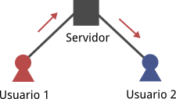
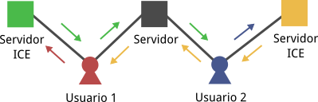
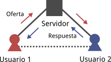
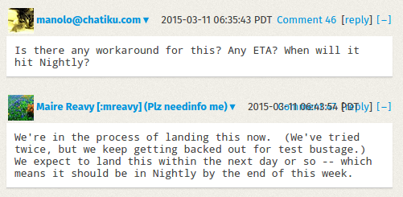
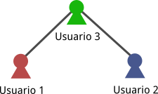
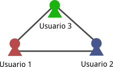
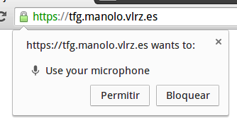
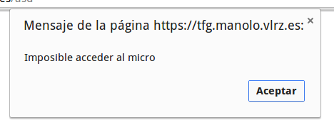

# Implementación de un servicio de multiconferencia P2P

## Introducción

## Tecnologías

Con el fin de realizar el proyecto propuesto se ha decido emplear el siguiente conjunto de tecnologías, primando estándares y herramientas abiertas frente a alternativas propietarias:

### HTML5

Con origen en el CERN, HTML ha evolucionado hasta convertirse en el lenguaje de marcado *de facto* de la web, aumentando su relevancia a la par que lo hace la variedad de terminales orientados al usuario final, siendo una elección recurrente a la hora de desarrollar aplicaciones multiplataforma.

Su última iteración, HTML5, introduce nuevos elementos que nos permiten redefinir el concepto de *aplicación web*, creando experiencias interactivas que van más allá del hipertexto.

### CSS3

Y si HTML se ha convertido en el lenguaje de marcado por excelencia de la web, CSS conforma el conjunto de reglas y estilos que nos permiten controlar la apariencia de los contenidos descritos en el documento HTML. De esta forma, cosas como el elemento `font` fueron paulatinamente desapareciendo de HTML para ceder el control a CSS, restringiendo las competencias de HTML a lo puramente semántico.

Con CSS3 la especificación se modulariza, desarrollando en paralelo cada una de las diferentes secciones y permitiendo aplicar rotaciones, transiciones e incluso complejos efectos de imagen.

### ECMAScript 6

Para completar el conjunto de tecnologías que permitan la creación de efectivas aplicaciones web se hace necesaria la incorporación de un tercer elemento: un lenguaje de programación. JavaScript hizo su aparición por primera vez en el navegador Netscape como una alternativa para *amateurs* a Java, el lenguaje de moda del momento.

Pese a que su soporte en navegadores nació prácticamente ligado al de Java, la popularidad del primero acabó eclipsando a la del segundo, a tal punto que hoy en día la presencia de las *Java applets* queda reducida a tareas computacionalmente intensivas, a menudo en webs compuestas en la era pre-HTML5.

ECMAScript, el nombre del lenguaje estandarizado por Ecma International detrás de JavaScript, es un lenguaje interpretado, dinámicamente tipado y basado en prototipos, además de otras características. En sus inicios, la misma hebra encargada de procesar JavaScript manejaba tanto HTML y CSS como la propia interfaz del navegador.

Como consecuencia, un script cuya ejecución durara varios segundos mantenía el resto del navegador bloqueado, a la espera de que el script finalizara. En un escenario como este, cosas como un simple `sleep` aparecen como inviables, pues dejarían el navegador inutilizado durante un tiempo apreciable, resultando en una experiencia de usuario nada agradable.

JavaScript evolucionó para adaptarse a estas limitaciones con el objetivo de limitar al máximo el tiempo de ejecución de cada llamada a funciones, convirtiéndose en la práctica en un lenguaje fuertemente asíncrono, aprovechando el concepto de *callbacks*. Tómese el siguiente código de ejemplo:

```javascript
console.log('hola');

setTimeout(function(){
  console.log('qué hay');
},1000);

console.log('mundo');
```

Este código de ejemplo se leería:

```
Imprime "hola\n"
Dentro de 1000ms imprime "qué hay\n"
Imprime "mundo\n"
```

Produciendo la siguiente salida:

```
hola
mundo
qué hay
```

De esta forma la ejecución del script es inmediata, permitiendo al navegador realizar otras tareas para, pasados 1000ms, ejecutar el código indicado. Esta arquitectura, aunque sorprendentemente eficiente para tareas como la lectura de ficheros, aumenta considerablemente la dificultad del control de flujo, además de afear el código abriendo las puertas al temido *callback hell*:

```javascript
console.log('Lorem');

setTimeout(function(){
  console.log('dolor');
  setTimeout(function(){
    console.log('sit');
    setTimeout(function(){
      console.log('amet');
    },1000);
  },1000);
},1000);

console.log('ipsum');
```

ECMAScript 6, de reciente aparición, introduce una nueva estructura que se ha convertido en la solución definitiva para el control de flujo en operaciones asíncronas dentro de JavaScript: las funciones generadoras. Con las herramientas adecuadas y un pequeño *setup*, el código anterior puede reescribirse de la siguiente manera:

```javascript
console.log('Lorem');

walk(function*(){
  yield wait(1000);
  console.log('dolor');
  yield wait(1000);
  console.log('sit');
  yield wait(1000);
  console.log('amet');
});

console.log('ipsum');
```

Debemos evitar pensar en JavaScript como un lenguaje concurrente: cada script se ejecuta en una sola hebra y *del tirón*. Antes de la aparición de las funciones generadoras, esto significaba que los callbacks no podían superponerse unos a otros: si planificamos la ejecución de dos callbacks distintos dentro de 500ms, primero se ejecutará uno y a continuación el siguiente.

Con la introducción de ECMAScript 6 a lo anterior hay que añadir que, dentro de una función generadora, solo se puede romper la ejecución al alcanzar la palabra clave `yield`. Así, a pesar de tener la ilusión de estar trabajando con un código síncrono, la ejecución es efectivamente asíncrona, dejando tiempo al navegador para ocuparse de otras tareas.

### HTTP/1.1

Ya tenemos el lenguaje de marcado, los estilos y el lenguaje de programación, solo resta establecer el protocolo de transporte. HTTP y su modelo petición - respuesta, cimentado sobre TCP, aparece como el protocolo ideal para la transmisión fiable de los datos que componen el código de nuestra aplicación web: texto.

Aunque existen nuevas versiones como SPDY o HTTP/2, el conjunto de métodos y la sintáxis del mensaje se mantienen invariantes desde HTTP/1.1, con las nuevas mejoras centrándose en los métodos de transporte. Esto nos permite trabajar sobre HTTP/1.1 sin renunciar a los avances introducidos en SPDY y HTTP/2, ya que una simple actualización de la librería subyacente basta para aprovechar prácticamente al máximo estas nuevas versiones.

### WebSocket

A pesar de la idoneidad de HTTP para transmitir el código de una aplicación web, presenta una clara limitación: el modelo petición - respuesta exige que la comunicación sea iniciada por el cliente. En muchas aplicaciones es deseable que el servidor sea capaz de enviar mensajes al cliente sin que éste los haya solicitado, mensajes a los que el cliente pueda reaccionar y actuar en consecuencia.

El modelo de seguridad presente en las aplicaciones web impide el manejo directo de conexiones TCP o UDP, limitándose a trabajar con conexiones HTTP. Para poder dar el salto a un protocolo más conveniente, en HTTP/1.1 se introduce la cabecera `upgrade`, una forma de indicar al servidor HTTP que se desea cambiar de protocolo reusando la misma conexión TCP.

Aprovechando el camino abierto gracias a esta cabecera, el IETF estandarizó en 2011 el protocolo WebSocket, dotando a las aplicaciones web de un canal de comunicación con las características de una conexión TCP, añadiendo el concepto de *mensajes* y permitiendo así una comunicación *full-duplex* más allá del modelo petición - respuesta.

### WebRTC 1.0

Con las tecnologías descritas hasta el momento sólo es posible comunicarse de forma directa con un servidor, motivo por el cual durante años las comunicaciones entre usuarios se realizaban de forma indirecta, usando el servidor como intermediario.



Resulta evidente lo ineficiente de esta técnica: la latencia, el tiempo que tarda en llegar un mensaje de un usuario a otro, se multiplica por dos, primero de un usuario al servidor, y luego del servidor al otro usuario. Era solo cuestión de tiempo que aparecieran las APIs y teconologías adecuadas para posibilitar la comunicación usuario a usuario, P2P, dentro del entorno de una aplicación web.

WebRTC, hecho público por Google en 2011, lleva en proceso de estandarización desde entonces, con diversos borradores disponibles y en constante cambio en la página del W3C. A pesar de tratarse de una API inestable los navegadores más modernos incorporan soporte para esta tecnología desde hace ya varios años, permitiendo así la creación de aplicaciones web que hagan uso de tecnología P2P sin necesidad de plugins, algo que cobra especial importancia en los dispositivos móviles.

WebRTC 1.0, la versión en la que se basan las implementaciones actuales, está cimentada en dos protocolos fundamentales: ICE y SDP. Haciendo uso de estos dos protocolos se construyen conexiones en tiempo real entre usuarios, entre navegadores, sin imponer un protocolo de transporte concreto y abriendo así las puertas al uso de soluciones basadas en UDP, algo anteriormente impensable en el mundo de las aplicaciones web sin el uso de plugins.

Puesto estos protocolos han de usarse para establecer la conexión, los mensajes tanto ICE como SDP se transmiten *fuera de banda*, usando los métodos que a cada desarrollador le parezcan oportunos. Esto típicamente implica transmitirlos de forma indirecta a través de un servidor mediante WebSocket o HTTP.

Dicho esto, es necesario diferenciar de forma clara las funciones de ambos protocolos, pues ambos responden a necesidades diferentes. La primera condición evidente a satisfacer viene dada por la necesidad de los *peers* de conocer el camino lógico a seguir para llegar del uno al otro a través de la red, sorteando firewalls y técnicas NAT.

Con este fin, es necesaria la intervención de servidores auxiliares que determinen aspectos tan importantes como la dirección pública de una red que se encuentre tras uno o varios niveles NAT o los puertos que determinado firewall permite usar, ya que esta información no está al alcance directo del propio *peer*. Así, el flujo de candidatos ICE vendría dado por la siguiente figura:



Como se aprecia, el usuario solicita al servidor ICE el envío de un candidato que contenga la información relevante: direcciones IP, puertos disponibles, etc. Una vez obtenido el candidato, éste se envía fuera de banda al otro usuario. El circuito se completa cuando ambos usuarios toman posesión de los candidatos correspondientes, pudiendo así determinar el camino a seguir para establecer una conexión.

Aún queda un aspecto por resolver: ¿qué uso se le dará a esa conexión? ¿Intercambio de datos binarios? ¿Transmisión y recepción de audio y video? ¿Con qué codecs? ¿Cuánto ancho de banda se usará? Con el fin de que ambos usuarios conozcan las respuestas a esas preguntas se utiliza el protocolo SDP.

Uno de los usuarios, el que inicia la conexión, elabora una oferta con las características de los canales de datos y flujos de audio y video que desea establecer, con información como los códecs disponibles y las restricciones de ancho de banda a imponer. Dicha oferta se envía fuera de banda - recordemos que aún no se ha establecido la conexión - al otro usuario, el cual, en base a los códecs y demás funciones de las que dispone, elabora su respuesta, incorporando en ella la información relevante de sus propios flujos de datos o audio y video, si los hubiera.



Una vez que el intercambio oferta - respuesta se ha completado y, por medio de los candidatos ICE, se ha encontrado el camino adecuado para la conexión, ésta queda correctamente establecida, permitiendo el envío de datos punto a punto, desde navegadores web, sin usar un servidor como intermediario: tecnología P2P a una URL de distancia.

### Web Audio API

A lo largo del grado no solo se nos ha enseñado a transmitir audio, también hemos aprendido a modularlo, a filtrarlo, en definitiva, a procesarlo. Ya en 2010 Mozilla implementó en su navegador una API a la que denominó Audio Data API, con un modelo similar al de la API que el W3C empezaría a estandarizar en 2013 bajo el nombre de Web Audio API.

La Web Audio API está basada en diagramas de bloques de los cuales se encarga el navegador a bajo nivel, los algoritmos que rigen su funcionamiento suelen estar implementados en ensamblador optimizado, aunque no es mandatorio. Además de estos bloques la especificación permite trabajar directamente con las muestras de audio mediante *Audio Workers*, esto es, instancias separadas del interpretador de JavaScript que se dedican a ejecutar un script determinado destinado a manipular en tiempo real dichas muestras.

Dicho esto, podemos distinguir tres tipos de bloques: fuentes (solo salida), sumideros (solo entrada) y bloques de procesado (una o varias entradas y salidas). Los bloques, además de entradas y salidas, tienen *atributos*: frecuencia, ganancia, etc. Las salidas pueden conectarse tanto a entradas como a atributos. A modo de ejemplo, en el siguiente script se obtiene un seno cuadrático a partir de dos osciladores y se reproduce:

```javascript
var ctx = new AudioContext(),
    
    osc1 = ctx.createOscillator(),
    osc2 = ctx.createOscillator(),
    
    amp = ctx.createGain();

// Valores inciales

amp.gain.value = 0;
osc1.frequency.value = osc2.frequency.value = 200;

// Conexiones

osc1.connect(amp);
osc2.connect(amp.gain);

amp.connect(ctx.destination);

// Arranque

osc1.start();
osc2.start();
```

El diagrama de bloques correspondiente sería el siguiente:


Puesto que la Web Audio API no implementa el bloque multiplicador, hemos de construirlo nosotros usando un amplificador con ganancia controlada por amplitud, la de la otra señal a multiplicar. El código de ejemplo suministrado hace sonar por la salida de audio un seno cuadrático obtenido de dos senos a frecuencia 200Hz, con lo que la señal obtenida tendrá cierto nivel de contínua y una frecuencia de 400Hz.

### Soporte en navegadores

Google Chrome, y en especial Mozilla Firefox, realizan un soberbio trabajo implementando las tecnologías más modernas incluso cuando su estandarización aún no ha sido completada, por lo que éstos y sus derivados contienen soporte en sus versiones estables tanto para WebRTC 1.0 como para la Web Audio API, sin fallos importantes de funcionamiento cuando ambas tecnologías trabajan por separado.

Los fallos aparecen al combinar ambas tecnologías. En el momento de este escrito, Google Chrome permite transmitir audio procesado, pero es incapaz de procesar audio recibido mediante WebRTC (véase el bug 121673 de Chromium). Según informan miembros del proyecto, arreglar este fallo implicaría un cuatrimestre de trabajo, y aún no han empezado a plantear una posible solución, por lo que a efectos de este escrito este fallo se considerará permanente.

Mozilla Firefox, por contrapartida, es capaz de procesar audio recibido a través de WebRTC sin problemas, pero la versión estable a fecha de escritura, Firefox 36, presenta fallos en el envío de audio procesado (véase el bug 1081819 de Mozilla). En la página del bug se me confirmó que estaría arreglado en la versión Nightly del momento, y en efecto el fallo se corrigió en la versión 39, cuyo paso a estable está previsto para Junio de este año.



### Node.js

Hasta ahora nos hemos centrado en tecnologías y estándares, toca hablar de software específico para servidores. Ya en 1994 Netscape ofreció herramientas que permitían la ejecución de JavaScript en servidores, sin embargo no fue hasta 2009 cuando, impulsado por el notable aumento de prestaciones de los modernos motores de JavaScript, Ryan Dahl creó Node.js. Desde entonces este proyecto basado en el motor de JavaScript de Google Chrome, V8, no ha hecho más que crecer, impulsando un nuevo modelo de servidores especialmente adecuados para aplicaciones en tiempo real.

Como ya se puso de manifiesto, los programas escritos en JavaScript se ejecutan en una sola hebra y con frecuencia adoptan un modelo asíncrono. Este modelo es una de las claves del éxito de Node.js, puesto que en un servidor las operaciones más lentas son las que implican esperar: esperar al disco duro, esperar a la base de datos, esperar a que lleguen mensajes a través de la red... Los servidores pasan la mayor parte del tiempo esperando.

Soluciones síncronas como PHP solventan este problema lanzando una hebra para cada petición web, con el consecuente consumo de recursos, para luego mantener esa hebra en espera de que se completen las operaciones de entrada y salida. Pero en JavaScript no existe ese problema, ya se vio como para esperar 1000ms y realizar alguna acción no es necesario bloquear la ejecución del programa gracias a su naturaleza asíncrona.

Como resultado de este cambio de paradigma se obtienen mejoras sustanciales en capacidad de usuarios y tiempo de respuesta, además de código reusable al compartir el mismo lenguaje de programación tanto en el cliente como en el servidor. En los últimos años se ha producido un aumento expectacular de la popularidad de Node.js, creando un ecosistema extenso y variado de librerías y recursos a través de su gestor de paquetes oficial, npm (*node package manager*).

## Desarrollo

### Esquema de funcionamiento

La aplicación a desarrollar persigue el establecimiento de conferencias de audio entre múltiples usuarios, en las cuales el audio se envíe a través de tecnología P2P. Teniendo en cuenta la capacidad de las tecnologías disponibles y mencionadas anteriormente, se ha decidido incorporar dos funcionalidades añadidas: distorsión opcional de audio y visionado de la transformada de Fourier del mismo.

Teniendo en cuenta las restricciones de las tecnologías en uso dadas por el soporte presente en los navegadores actuales, el esquema a implementar de la conexión entre dos usuarios cualesquiera sería el siguente:


Tal como se observa, el visionado de la transformada de Fourier del audio enviado por el usuario remoto se realiza en base a los datos enviados por él mismo, para circundar los fallos asociados al procesamiento de audio recibido a través de WebRTC presentes en Google Chrome.

De esta manera, cada usuario procesa únicamente su propio audio, y envía los resultados de este procesamiento al resto de los usuarios. Este modelo protege la privacidad de cada usuario al ser ellos los únicos que tienen acceso al audio sin distorsionar, aunque permite falsear la transformada de Fourier.

Este es un punto no crítico dado por la necesidad de satisfacer las deficiencias de Google Chrome, que además presenta una clara ventaja: cada transformada de Fourier se realiza una sola vez, reduciendo así el coste de procesamiento en detrimento del ancho de banda utilizado.

En el esquema presentado también se aprecia que, aunque a cada usuario se le presenta información de la transformada de Fourier tanto del audio remoto como del propio, sólo se reproduce el audio remoto, puesto que, además de carecer de información relevante, la reproducción del audio propio puede ocasionar, en entornos en los que el micrófono no esté suficientemente aislado de los altavoces, una realimentación positiva que resulte en la saturación de los altavoces provocando el conocido sonido asociado al *acople*.

Una vez decidida la estructura de la conexión entre usuarios, se ha de escoger la topología de red a nivel de aplicación. Si la aplicación sólo ha de conectar entre sí a dos usuarios, la topología se hace evidente:


Los problemas aparecen al introducir más usuarios. Supongamos que introducimos un tercer usuario y escogemos una topología como la que sigue:



En la topología escogida, *Usuario 1* ha de envíar su audio a *Usuario 2* a través de *Usuario 3*. El principal motivo de elección de esta topología es la reducción del ancho de banda utilizado: en una operación *broadcast* el audio sólo debe enviarse una vez. Sin embargo, además de disminuir el ancho de banda necesario, esta topología tiene fundamentalmente dos deficiencias: aumento de la latencia y graves problemas de seguridad.

El hecho de enviar audio a través de un intermediario en un entorno P2P exige la implementación de criptografía asimétrica, así como el uso de autoridades de certificación, a nivel de aplicación, para cada *peer*, con el fin de evitar ataques *man in the middle*, esto es, para el ejemplo dado, que *Usuario 3* se haga pasar por *Usuario 1*.

Estos algoritmos son lentos y difíciles de implementar en el entorno de una aplicación web, empeorando de forma prohibitiva la latencia, que debe mantenerse baja en aplicaciones de tiempo real como la que nos concierne. Así, para la implementación de la aplicación, se ha elegido una topología de malla completa, con todos los usuarios conectados de forma directa entre sí:



### Obtención y distorsión del audio

Una vez definido el esquema general de funcionamiento de la aplicación, procedemos a analizar los detalles de la implementación, comenzando por el punto de partida: la obtención del flujo de audio. El entorno web goza de un modelo de seguridad claramente diferenciado del presente en las aplicaciones nativas, con un acceso al *hardware* del terminal fuertemente limitado.

Así, para otorgar acceso al micrófono a nuestra aplicación, el navegador primero solicitará la autorización explícita del usuario. Con el objetivo de no paralizar la ejecución hasta que se produzca dicha autorización, esta tarea viene implementada en forma de una API asíncrona. De esta manera, el código necesario para obtener el flujo de audio asociado al micrófono del terminal es el siguiente:

```javascript
navigator.getUserMedia({audio: true},
  
  function(stream){
    // El usuario autorizó el
    // acceso al micrófono
  },
  
  function(error){
    // El usuario denegó el
    // acceso o se produjo
    // un error
  }
  
);
```

Si el usuario accede a permitir el acceso al micrófono, el curso de la aplicación prosigue. En caso contrario, se muestra una alerta y se procede a cargar de nuevo la página de inicio de la aplicación. El usuario tendrá entonces una oportunidad adicional de conceder el permiso pertinente. En la versión de desarrollador de Google Chrome a fecha de escritura (43), los diálogos de alerta y concesión de permisos tienen el siguiente aspecto:





Tras la adquisición del flujo de audio se introducirá la distorsión correspondiente. Buscando intencionadamente la introducción de *aliasing*, se ha decidido implementar la distorsión de audio mediante una modulación DBL demodulada con un cierto error de frecuencia.

Partiendo de conceptos básicos sobre la transformada de Fourier, el funcionamiento es muy sencillo. El espectro de una sinusoide está formado por un par de *deltas* de amplitud mitad, una en frecuencias positivas, a la frecuencia de la sinusoide, y otra en frecuencias negativas. Teniendo en cuenta la dualidad multiplicación-convolución, al multiplicar una señal en el dominio del tiempo por una sinusoide dada el espectro de la señal se *divide* en dos copias de amplitud mitad cuyas frecuencias centrales se encuentran separadas entre sí el doble de la frecuencia de la sinusoide.

Si la frecuencia de la sinusoide es lo suficientemente grande, al multiplicar de nuevo la señal obtenida por una nueva sinusoide con la misma frecuencia y en fase con la usada anteriormente se consigue recuperar el espectro de la señal original atenuado a la mitad de amplitud, junto con un par de copias a frecuencias elevadas. Basta filtrar y amplificar para obtener la señal original.


Consideremos ahora el efecto de introducir un error de frecuencia en demodulación, esto es, usar una frecuencia ligeramente distinta para la segunda sinusoide. La señal recuperada no será ya la original, sino una cuyo espectro sea el resultado de la superposición del espectro de la señal original adelantado en frecuencia con el suyo mismo retrasado. A la distorsión obtenida nos referiremos como *efecto Wall-E*, por su parecido con la voz del personaje Disney.


Una vez definida la estructura de la distorsión, pasamos a diseñar el funcionamiento de la misma haciendo uso de la Web Audio API. De acuerdo al ejemplo expuesto anteriormente, serán necesarios dos osciladores, para implementar la portadora en transmisión y recepción, dos filtros, uno para limitar la señal en frecuencia y otro en demodulación, y tres bloques de ganancia, dos de ellos para implementar los productos y uno para añadir la ganancia del filtro de demodulación.

Partiendo del flujo obtenido mediante la API `getUserMedia` obtenemos un bloque `MediaStreamAudioSourceNode`, sin entradas y con una salida, que representa el flujo de audio obtenido. Este flujo se hace pasar a través de un filtro bicuadrático paso bajo para limitarlo en frecuencia como parte de la modulación en DBL. Siendo conscientes de las no idealidades de los filtros reales, elegiremos un filtro con una frecuencia de corte igual a la sexta parte de la frecuencia de muestreo.

Con el fin de evitar el aliasing debido a las copias en frecuencia asociadas al procesado discreto, se ha establecido la frecuencia de la portadora como la cuarta parte de la frecuencia de muestreo. Cabe mencionar que, además, la Web Audio API establece que los propios navegadores deben esforzarse por evitar este tipo de aliasing, aunque no impone ningún mecanismo concreto. De esta forma, se multiplicará la señal por un primer oscilador a dicha frecuencia, y a continuación se multiplicará la señal resultante por un segundo oscilador que podrá presentar una variación desde 0 a 200Hz conforme a la del primero, seleccionable por el usuario. Tan solo resta filtrar para obtener la señal con la distorsión seleccionada.


### Transformada de Fourier


### Envío de audio e información de la FFT

### Interfaz

## Conclusiones

## Bibliografía

